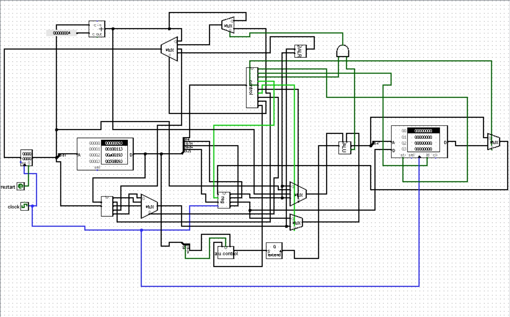

# Impulse-Core
# RISC-V Core (Single-Cycle)

<div align='center'>
  <br>
  
</div>

<br>


<br>

## Overview

**Impulse-Core** is a **complete single-cycle RISC-V (RV32I) processor** implemented from scratch in **Chisel (Scala)**. Every stage of the datapath — fetch, decode, execute, memory, and write-back — is written in hardware-description style and verified with cycle-accurate simulation.

The core supports the **full RV32I base integer instruction set**:

- **R-type** : `ADD`, `SUB`, `AND`, `OR`, `XOR`, `SLT`, `SLTU`, `SLL`, `SRL`, `SRA`
- **I-type** : `ADDI`, `ANDI`, `ORI`, `XORI`, `SLTI`, `SLTIU`, `SLLI`, `SRLI`, `SRAI`
- **Load / Store** : `LW`, `SW`
- **Branch** : `BEQ`, `BNE`, `BLT`, `BGE`, `BLTU`, `BGEU`
- **Jump** : `JAL`, `JALR`
- **Upper Immediate** : `LUI`, `AUIPC`

Testing is done with [chiseltest](https://github.com/ucb-bar/chiseltest) and waveforms can be viewed in [GTKWave](http://gtkwave.sourceforge.net/).

---

## Datapath Architecture

The processor follows the classic **single-cycle RISC-V datapath**:


   +-------+  pcValue  +----------+   instruction
   |  PC   |---------->| InstMem  |---------------> decode
   |       |           +----------+
   |       | pcPlus4
   +---^---+
       | nextPC
       |
       |     +-----------------+
       |     |   NEXT-PC MUX   |
       |     | JALR/JAL/Branch |
       |     |   /PC+4         |
       |     +-----------------+
       |
   (Decode: ControlUnit + RegFile + ImmGen + ALUControl)
       |
       v
   (Execute: ALU)
       |
       v
   (Memory: DataMem)
       |
       v
   (Write-Back MUX -> RegFile)
```

Every cycle:

1. **PC** sends the current address to **Instruction Memory**.
2. **Instruction Memory** returns the 32-bit instruction.
3. **Control Unit**, **Register File**, and **Immediate Generator** decode it.
4. **ALU** performs the arithmetic or logic operation.
5. **Data Memory** handles loads and stores.
6. **Write-Back MUX** selects what value goes back into the register file.
7. **Next-PC MUX** decides the address of the next instruction.

---

## Project Structure

```
Impulse-Core/
├── build.sbt
├── README.md
├── images/
│   └── datapath.png
└── src/
    ├── main/scala/core/
    │   ├── aluOP.scala
    │   ├── ALUControl.scala
    │   ├── ALUOP.scala
    │   ├── ControlUnit.scala
    │   ├── DataMem.scala
    │   ├── ImmGen.scala
    │   ├── InstMem.scala
    │   ├── PC.scala
    │   ├── RegFile.scala
    │   └── TOP.scala
    └── test/scala/core/
        ├── Instructions.hex
        ├── TOPTest.scala
        └── ... (other test files)
```

---

## Getting Started

First, clone this repository:

```bash
git clone https://github.com/Aaminahcodes/Impulse-Core.git
cd Impulse-Core
```

### Prerequisites

You need the following tools installed:

- **JDK 8 or 11** (Java Development Kit)
- **sbt** (Scala Build Tool)
- **GTKWave** (for viewing waveforms)

On Ubuntu / Debian:

```bash
sudo apt install openjdk-11-jdk sbt gtkwave -y
```

On macOS (with Homebrew):

```bash
brew install openjdk@11 sbt gtkwave
```

---

## Preparing Your Program

Create a `.hex` file containing the **hexadecimal** encoding of your RISC-V program. You can generate hex codes using the [Venus RISC-V Simulator](https://venus.cs61c.org/) or any RV32I assembler.

Each instruction's hex code must be on a **separate line**, with no comments and no blank lines.

### Example Program: Fibonacci

The default program included in this repository computes the first **8 Fibonacci numbers** (`0, 1, 1, 2, 3, 5, 8, 13`) and stores them sequentially in data memory.

```ruby
00000093
00100113
00800193
00000213
00122023
00222223
00820213
02018063
002082b3
00522023
000100b3
00028133
00420213
fff18193
fe5ff06f
0000006f
```

Equivalent RISC-V assembly:

```asm
        addi x1, x0, 0        # x1 = 0        (fib[0])
        addi x2, x0, 1        # x2 = 1        (fib[1])
        addi x3, x0, 8        # x3 = 8        (loop count)
        addi x4, x0, 0        # x4 = 0        (memory pointer)

loop:
        sw   x1, 0(x4)        # Mem[x4]   = x1
        sw   x2, 4(x4)        # Mem[x4+4] = x2
        addi x4, x4, 8        # x4 += 8
        beq  x3, x0, done     # if x3 == 0, exit
        add  x5, x1, x2       # x5 = x1 + x2  (next Fibonacci)
        sw   x5, 0(x4)        # Mem[x4] = x5
        add  x1, x2, x0       # x1 = x2
        add  x2, x5, x0       # x2 = x5
        addi x4, x4, 4        # x4 += 4
        addi x3, x3, -1       # x3 -= 1
        jal  x0, loop         # jump back to loop

done:
        jal  x0, done         # infinite loop (halt)
```

Save this file at:

```
src/test/scala/core/Instructions.hex
```

To use your own program, simply replace the contents of `Instructions.hex` with your own hex instructions, one per line.

---

## Configuring the Instruction Memory Path

Open the test file:

```
src/test/scala/core/TOPTest.scala
```

Find the following line:

```scala
test(new TOP("src/test/scala/core/Instructions.hex")) { dut =>
```

If you saved your `.hex` file elsewhere, change the path in the string to match the new location.

---

## Running the Simulation

From the root of the repository, start `sbt`:

```bash
cd Impulse-Core
sbt
```

When the terminal shows the sbt prompt:

```ruby
sbt:Impulse-Core>
```

Run the test suite:

```ruby
sbt:Impulse-Core> test
```

Or run only the datapath test:

```ruby
sbt:Impulse-Core> testOnly TOPTest
```

On success, sbt will print:

```
[info] Tests: succeeded 1, failed 0
```

---

## Viewing Waveforms in GTKWave

After a successful run, sbt creates a folder called **`test_run_dir/`** at the root of the project. Inside, locate the subfolder whose name matches your test (it will contain the word `TOP`).

Find the generated VCD file:

```bash
find . -name "*.vcd"
```

Open it with GTKWave:

```bash
gtkwave test_run_dir/<test_folder>/testOnly TOPTest -- -DwriteVcd=1
```

You can now inspect signals like **PC**, **instruction**, **aluResult**, and **writeBackData** cycle-by-cycle. If you only see a few clock pulses, press `Shift + Ctrl + F` (Zoom Fit) to view the entire trace.

---

## Technologies Used

- **Chisel 3** — hardware construction language embedded in Scala
- **Scala 2.12** — host language
- **sbt** — build tool
- **chiseltest** — Chisel's testing framework
- **GTKWave** — waveform viewer

---

## Contact

- **Author** : Amna Mehmood
- **GitHub** : [@Aaminahcodes](https://github.com/Aaminahcodes)

---

